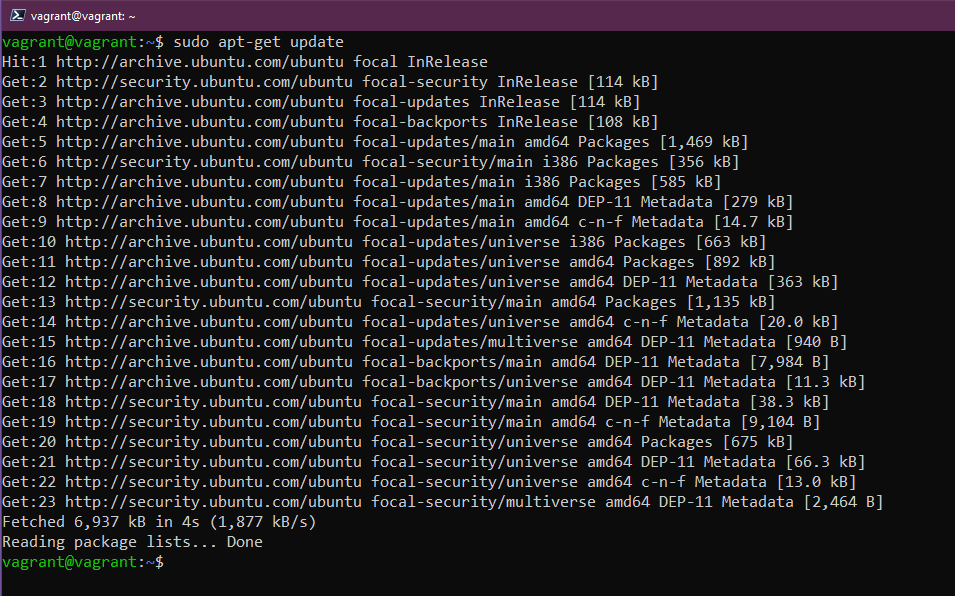
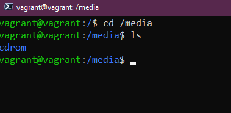
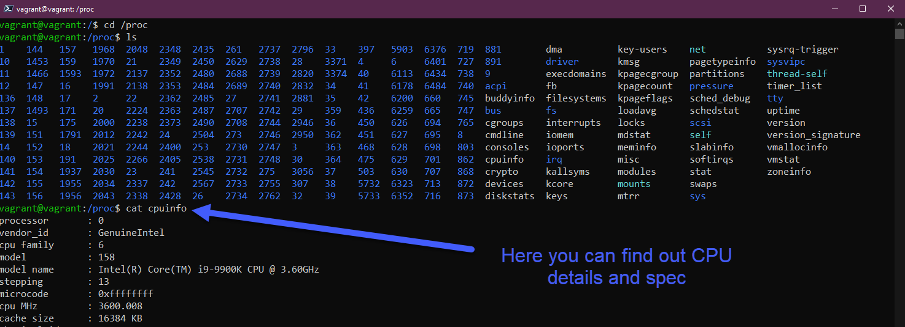
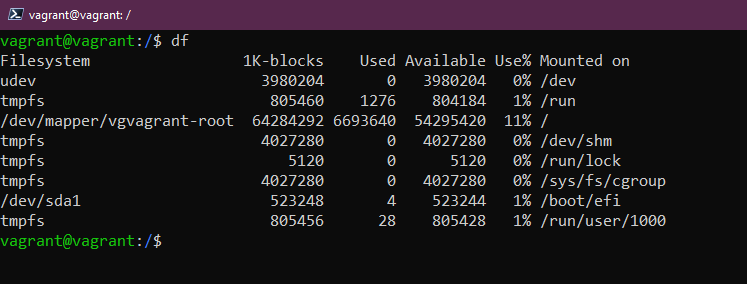

## Managing your Linux System, Filesystem & Storage

So far we have had a brief overview of Linux and DevOps and then we got our lab environment set up using vagant [(Day 14)](day14.md), we then touched on a small portion of commands that will be in your daily toolkit when in the terminal and getting things done [(Day 15)](day15.md). 

Here we are going to look into three key areas of looking after your Linux systems with updates, installing software, understanding what system folders are used for and we will also take a look at storage. 

## Managing Ubuntu & Software

The first thing we are going to look at is how we update our operating system. Most of you will be familiar with this process in a Windows OS and macOS, this looks slightly different on a Linux desktop and server.  

We are going to be looking at the apt package manager, this is what we are going to use on our Ubuntu VM for updates and software installation. 

Generally, at least on dev workstations, I run this command to make sure that I have the latest available updates from the central repositories, before any software installation.  

`sudo apt-get update`

Now we have an updated Ubuntu VM with the latest OS updates installed. We now want to get some software installed here. 

Let's choose `figlet` which is a program that generates text banners.

If we type `figlet` in our terminal you are going to see that we do not have it installed on our system. 

You will see from the above though that it does give us some `apt` install options that we could try. This is because in the default repositories there is a program called figlet.  Let's try `sudo apt install figlet`

We can now use our `figlet` app as you can see below. 

If we want to remove that or any of our software installations we can also do that via the `apt` package manager. 

`sudo apt remove figlet`

There are third party repositories that we can also add to our system, the ones we have access to out of the box are the Ubuntu default repositories. 

If for example, we wanted to install vagrant on our Ubuntu VM we would not be able to right now and you can see this below on the first command issued. We then add the key to trust the HashiCorp repository, then add the repository to our system.  

Once we have the HashiCorp repository added we can go ahead and run `sudo apt install vagrant` and get vagrant installed on our system. 

There are so many options when it comes to software installation, different options for package managers, built into Ubuntu we could also use snaps for our software installations. 

Hopefully, this gives you a feel about how to manage your OS and software installations on Linux. 

## File System Explained 

Linux is made up of configuration files, if you want to change anything then you change these configuration files. 

On Windows, you have C: drive and that is what we consider the root. On Linux we have `/` this is where we are going to find the important folders on our Linux system. 

- `/bin` - Short for binary, the bin folder is where our binaries that your system needs, executables and tools will mostly be found here.  

- `/boot` - All the files your system needs to boot up. How to boot up, and what drive to boot from. 

- `/dev` - You can find device information here, this is where you will find pointers to your disk drives `sda` will be your main OS disk. 

- `/etc` Likely the most important folder on your Linux system, this is where the majority of your configuration files. 

- `/home` - this is where you will find your user folders and files. We have our vagrant user folder. This is where you will find your `Documents` and `Desktop` folders that we worked in for the commands section. 

- `/lib` - We mentioned that `/bin` is where our binaries and executables live, `/lib` is where you will find the shared libraries for those. 

- `/media` - This is where we will find removable devices. 

- `/mnt` - This is a temporary mount point. We will cover more here in the next storage section. 

- `/opt` - Optional software packages. You will notice here that we have some vagrant and virtual box software stored here. 

- `/proc` - Kernel & process information, similar to `/dev`

- `/root` - To gain access you will need to sudo into this folder. The home folder for root. 

- `/run` -Placeholder for application states.

- `/sbin` - Sudo bin, similar to the bin folder but these tools are intended for elevated superuser privileges on the system.

- `/tmp` - temporary files. 

- `/usr` - If we as a standard user have installed software packages it would generally be installed in the `/usr/bin` location. 

- `/var` - Our applications get installed in a `bin` folder. We need somewhere to store all of the log files this is `/var`   

## Storage 

When we come to a Linux system or any system we might want to know the available disks and how much free space we have on those disks. The next few commands will help us identify and use and manage storage. 

- `lsblk` List Block devices. `sda` is our physical disk and then `sda1, sda2, sda3` are our partitions on that disk. 

- `df` gives us a little more detail about those partitions, total, used and available. You can parse other flags here I generally use `df -h` to give us a human output of the data. 

If you were adding a new disk to your system and this is the same in Windows you would need to format the disk in disk management, in the Linux terminal you can do this by using the `sudo mkfs -t ext4 /dev/sdb` with sdb relating to our newly added disk. 

We would then need to mount our newly formatted disk so that it was useable. We would do this in our `/mnt` folder previously mentioned and we would create a directory there with `sudo mkdir NewDisk` we would then use `sudo mount /dev/sdb newdisk` to mount the disk to that location. 

It is also possible that you will need to unmount storage from your system safely vs just pulling it from the configuration. We can do this with `sudo umount /dev/sdb` 

If you did not want to unmount that disk and you were going to be using this disk for a database or some other persistent use case then you want it to be there when you reboot your system. For this to happen we need to add this disk to our `/etc/fstab` configuration file for it to persist, if you don't it won't be useable when the machine reboots and you would manually have to go through the above process. The data will still be there on the disk but it won't automount unless you add the configuration to this file. 

Once you have edited the `fstab` configuration file you can check your workings with `sudo mount -a` if no errors then your changes will now be persistent across restarts. 

We will cover how you would edit a file using a text editor in a future session. 

## Resources 

- [Learn the Linux Fundamentals - Part 1](https://www.youtube.com/watch?v=kPylihJRG70)
- [Linux for hackers (don't worry you don't need to be a hacker!)](https://www.youtube.com/watch?v=VbEx7B_PTOE)

See you on [Day17](day17.md)
