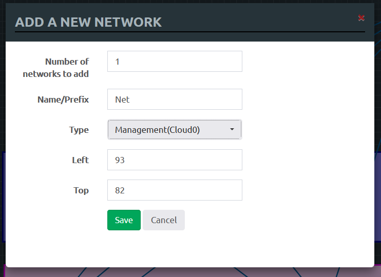
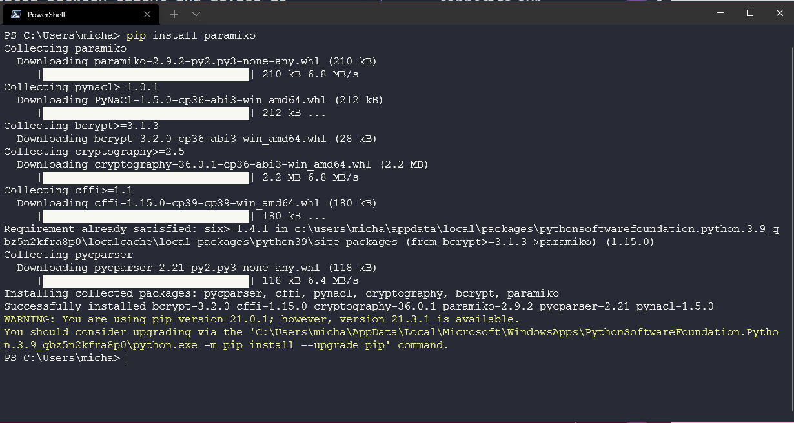

## Getting Hands-On with Python & Network

In this final section of Networking fundamentals, we are going to cover some automation tasks and tools with our lab environment created on [Day 26](day26.md) 

We will be using an SSH tunnel to connect to our devices from our client vs telnet. The SSH tunnel created between client and device is encrypted. We also covered SSH in the Linux section on [Day 18](day18.md)

## Access our virtual emulated environment

For us to interact with our switches we either need a workstation inside the EVE-NG network and you can deploy a Linux box there with Python installed to perform your automation ([Resource for setting up Linux inside EVE-NG](https://www.youtube.com/watch?v=3Qstk3zngrY)) or you can do something like me and define a cloud for access from your workstation. 


To do this, we have right-clicked on our canvas and we have selected network and then selected "Management(Cloud0)" this will bridge out to our home network. 



However, we do not have anything inside this network so we need to add connections from the new network to each of our devices. (My networking knowledge needs more attention and I feel that you could just do this next step to the top router and then have connectivity to the rest of the network through this one cable?)

I have then logged on to each of our devices and I have run through the following commands for the interfaces applicable for where the cloud comes in. 

```
enable
config t
int gi0/0
ip add dhcp 
no sh 
exit 
exit
sh ip int br
```

The final step gives us the DHCP address from our home network. My device network list is as follows: 

| Node        | IP Address  | Home Network IP  |
| ----------- | ----------- | -----------      |
| Router      | 10.10.88.110| 192.168.169.115  |
| Switch1     | 10.10.88.111| 192.168.169.178  |
| Switch2     | 10.10.88.112| 192.168.169.193  |
| Switch3     | 10.10.88.113| 192.168.169.125  |
| Switch4     | 10.10.88.114| 192.168.169.197  |

### SSH to a network device 

With the above in place, we can now connect to our devices on our home network using our workstation. I am using Putty but also have access to other terminals such as git bash that give me the ability to SSH to our devices. 

Below you can see we have an SSH connection to our router device. (R1)


### Using Python to gather information from our devices 

The first example of how we can leverage Python is to gather information from all of our devices and in particular, I want to be able to connect to each one and run a simple command to provide me with interface configuration and settings. I have stored this script here [netmiko_con_multi.py](Networking/netmiko_con_multi.py)

Now when I run this I can see each port configuration over all of my devices. 


This could be handy if you have a lot of different devices, create this one script so that you can centrally control and understand quickly all of the configurations in one place. 

### Using Python to configure our devices 

The above is useful but what about using Python to configure our devices, in our scenario we have a trunked port between `SW1` and `SW2` again imagine if this was to be done across many of the same switches we want to automate that and not have to manually connect to each switch to make the configuration change. 

We can use [netmiko_sendchange.py](Networking/netmiko_sendchange.py) to achieve this. This will connect over SSH and perform that change on our `SW1` which will also change to `SW2`. 


Now for those that look at the code, you will see the message appears and tells us `sending configuration to device` but there is no confirmation that this has happened to we could add additional code to our script to perform that check and validation on our switch or we could modify our script before to show us this. [netmiko_con_multi_vlan.py](Networking/netmiko_con_multi_vlan.py)


### backing up your device configurations 

Another use case would be to capture our network configurations and make sure we have those backed up, but again we don't want to be connecting to every device we have on our network so we can also automate this using [backup.py](Networking/backup.py). You will also need to populate the [backup.txt](Networking/backup.txt) with the IP addresses you want to backup. 

Run your script and you should see something like the below. 


That could be me just writing a simple print script in python so I should show you the backup files as well. 


### Paramiko 

A widely used Python module for SSH. You can find out more at the official GitHub link [here](https://github.com/paramiko/paramiko)

We can install this module using the `pip install paramiko` command. 



We can verify the installation by entering the Python shell and importing the paramiko module. 


### Netmiko 

The netmiko module targets network devices specifically whereas paramiko is a broader tool for handling SSH connections overall. 

Netmiko which we have used above alongside paramiko can be installed using `pip install netmiko` 

Netmiko supports many network vendors and devices, you can find a list of supported devices on the [GitHub Page](https://github.com/ktbyers/netmiko#supports) 

### Other modules 

It is also worth mentioning a few other modules that we have not had the chance to look at but they give a lot more functionality when it comes to network automation. 

`netaddr` is used for working with and manipulating IP addresses, again the installation is simple with `pip install netaddr` 

you might find yourself wanting to store a lot of your switch configuration in an excel spreadsheet, the `xlrd` will allow your scripts to read the excel workbook and convert rows and columns into a matrix. `pip install xlrd` to get the module installed. 

Some more use cases where network automation can be used that I have not had the chance to look into can be found [here](https://github.com/ktbyers/pynet/tree/master/presentations/dfwcug/examples)

I think this wraps up our Networking section of the #90DaysOfDevOps, Networking is one area that I have not touched for a while really and there is so much more to cover but I am hoping between my notes and the resources shared throughout it is helpful for some. 

## Resources 

- [Free Course: Introduction to EVE-NG](https://www.youtube.com/watch?v=g6B0f_E0NMg)
- [EVE-NG - Creating your first lab](https://www.youtube.com/watch?v=9dPWARirtK8)
- [3 Necessary Skills for Network Automation](https://www.youtube.com/watch?v=KhiJ7Fu9kKA&list=WL&index=122&t=89s)
- [Computer Networking full course](https://www.youtube.com/watch?v=IPvYjXCsTg8)
- [Practical Networking](http://www.practicalnetworking.net/)
- [Python Network Automation](https://www.youtube.com/watch?v=xKPzLplPECU&list=WL&index=126)

Most of the examples I am using here as I am not a Network Engineer have come from this extensive book which is not free but I am using some of the scenarios to help understand Network Automation. 

- [Hands-On Enterprise Automation with Python (Book)](https://www.packtpub.com/product/hands-on-enterprise-automation-with-python/9781788998512)

See you on [Day 28](day28.md) where will start looking into cloud computing and get a good grasp and foundational knowledge of the topic and what is available. 