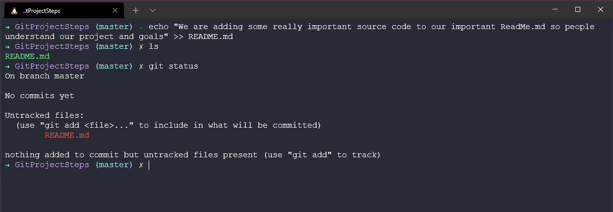
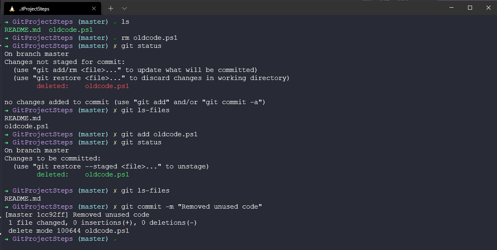

## Staging & Changing

We have already covered some of the basics but putting things into a walkthrough makes it better for me to learn and understand how and why we are doing it this way. Before we get into any git-based services such as GitHub, git has its powers that we can take advantage of on our local workstation. 

We are going to take the project folder we created at the start of the git session and we are going to walk through some of the simple steps we can do with git. We created a folder on our local machine and we initialised it with the `git init` command 

We can also see now that we have initialised the folder we have a hidden folder in our directory. 

This is where the details of the git repository are stored as well as the information regarding our branches and commits. 

### Staging Files

We then start working on our empty folder and maybe we add some source code as a first days work. We create our readme.md file and we can see that file in the directory, next we check our `git status` and it knows about the new readme.md file but we have not committed the file yet. 

We can stage our readme.md file with the `git add README.md` command then we can see changes to be committed which we did not have before and a green new file.

Next up we want to commit this, our first commit or our first snapshot of our project. We can do this by using the `git commit -m "Meaningful message"` command so that we can easily see what has changed for each commit. Also, notice the yellow cross changes now to a green tick. This is something I have within my terminal with the theme I use, something we covered in the Linux section. 

### Committing Changes

We are going to most likely want to add more files or even change the files we have in our directory. We have already done our first commit above. But now we are going to add more details and more files. 

We could repeat our process from before, create or edit our file > `git add .` to add all files to the staging area then `git commit -m "meaningful message"` and this would work just fine. But to be able to offer a meaningful message on commit of what has changed you might not want to write something out like `git commit -m "Well, I changed some code because it did not work and when I fixed that I also added something new to the readme.md to ensure everyone knew about the user experience and then I made a tea."` I mean this would work as well although probably make it descriptive but the preferred way here is to add this with a text editor. 

If we run `git commit` after running `git add` it will open our default text editor which in my case here is nano. Here are the steps I took to add some changes to the file, ran `git status` to show what is and what is not staged. Then I used `git add` to add the file to the staging area, then ran `git commit` which opened nano.

When nano opens you can then add your short and long description and then save the file. 

### Committing Best Practices

There is a balance here to when to commit, commit often. We do not want to be waiting to be finished the project before committing, each commit should be meaningful and they also should not be coupled with non-relevant tasks with each other. If you have a bug fix and a typo make sure they are two separate commits as a best practice. 

Make the commit message mean something. 

In terms of wording, the team or yourself should be sticking to the same wording for each commit. 

### Skipping the Staging Area

Do we always have to stage our changes before committing them? 

The answer is yes but don't see this as a shortcut, you have to be sure 100% that you are not needing that snapshot to roll back to, it is a risky thing to do. 

### Removing Files

What about removing files from our project, maybe we have another file in our directory that we have committed but now the project no longer needs or using it, as a best practice we should remove it. 

Just because we remove the file from the directory, git is still aware of this file and we also need to remove it from the repository. You can see the workflow for this below. 

That could be a bit of a pain to either remember or have to deal with if you have a large project which has many moving files and folders. We can do this with one command with `git rm oldcode.ps1` 

### Renaming or Moving Files

Within our operating system, we can rename and move our files. We will no doubt need to do this from time to time with our projects. Similar to removing though there is a two-step process, we change our files on our OS and then we have to modify and make sure that the staging area or that the files are added correctly. Steps as follows: 

However, like removing files from the operating system and then the git repository we can perform this rename using a git command too. 

### Ignoring Files

We may have the requirement to ignore files or folders within our project that we might be using locally or that will be just wasted space if we were to share with the overall project, a good example of this could be logs. I also think using this for secrets that you do not want to be shared out in public or across teams. 

We can ignore files by adding folders or files to the `.gitignore` file in our project directory. 

You can then open the `.gitignore` file and see that we have the logs/ directory present. But we could also add additional files and folders here to ignore. 

We can then see `git status` and then see what has happened. 

There are also ways in which you might need to go back and ignore files and folders, maybe you did want to share the logs folder but then later realised that you didn't want to. You will have to use `git rm --cached ` to remove files and folders from the staging area if you have a previously tracked folder that you now want to ignore. 

### Short Status

We have been using `git status` a lot to understand what we have in our staging area and what we do not, it's a very comprehensive command with lots of detail. Most of the time you will just want to know what has been modified or what is new? We can use `git status -s` for a short status of this detail. I would usually set an alias on my system to just use `git status -s` vs the more detailed command. 

In the post tomorrow we will continue to look through these short examples of these common git commands. 

## Resources 

- [What is Version Control?](https://www.youtube.com/watch?v=Yc8sCSeMhi4)
- [Types of Version Control System](https://www.youtube.com/watch?v=kr62e_n6QuQ)
- [Git Tutorial for Beginners](https://www.youtube.com/watch?v=8JJ101D3knE&t=52s) 
- [Git for Professionals Tutorial](https://www.youtube.com/watch?v=Uszj_k0DGsg) 
- [Git and GitHub for Beginners - Crash Course](https://www.youtube.com/watch?v=RGOj5yH7evk&t=8s) 
- [Complete Git and GitHub Tutorial](https://www.youtube.com/watch?v=apGV9Kg7ics)
- [Git cheatsheet](https://www.atlassian.com/git/tutorials/atlassian-git-cheatsheet)

See you on [Day 39](day39.md) 
