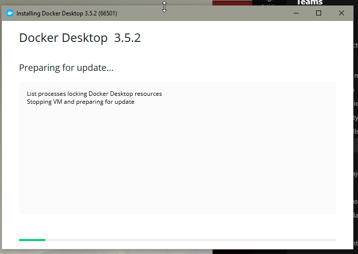

## What is Docker & Getting installed

In the previous post I mentioned Docker at least once and that is because Docker is really innovative in the making containers popular even though they have been around for such a long time. 

We are going to be using and explaining docker here but we should also mention the [Open Container Initiative (OCI)](https://www.opencontainers.org/) which is an industry standards organization that encourages innovation while avoiding the danger of vendor lock-in. Thanks to the OCI, we have a choice when choosing a container toolchain, including Docker, [CRI-O](https://cri-o.io/), [Podman](http://podman.io/), [LXC](https://linuxcontainers.org/), and others.

Docker is a software framework for building, running, and managing containers. The term "docker" may refer to either the tools (the commands and a daemon) or to the Dockerfile file format.

We are going to be using Docker Personal here which is free (for education and learning). This includes all the essentials that we need to cover to get a good foundation of knowledge of containers and tooling. 

It is probably worth breaking down some of the "docker" tools that we will be using and what they are used for. The term docker can be referring to the docker project overall, which is a platform for devs and admins to develop, ship and run applications. It might also be a reference to the docker daeemon process running on the host which manages images and containers also called Docker Engine. 

### Docker Engine 

Docker Engine is an open source containerization technology for building and containerizing your applications. Docker Engine acts as a client-server application with:

- A server with a long-running daemon process dockerd.
- APIs which specify interfaces that programs can use to talk to and instruct the Docker daemon.
- A command line interface (CLI) client docker.

The above was taken from the official Docker documentation and the specific [Docker Engine Overview](https://docs.docker.com/engine/)

### Docker Desktop 
We have a docker desktop for both Windows and macOS systems. An easy to install, lightweight docker development environment. A native OS application that leverages virtualisation capabilities on the host operating system. 

It’s the best solution if you want to build, debug, test, package, and ship Dockerized applications on Windows or macOS. 

On Windows we are able to also take advantage of WSL2 and Microsoft Hyper-V. We will cover some of the WSL2 benefits as we go through. 

Because of the integration with hypervisor capabilities on the host operating system docker provides the ability to run your containers with Linux Operating systems. 

### Docker Compose 
Docker compose is a tool that allows you to run more complex apps over multiple containers. With the benefit of being able to use a single file and command to spin up your application. 

### Docker Hub 
A centralised resource for working with Docker and its components. Most commonly known as a registry to host docker images. But there is a lot of additional services here which can be used in part with automation or integrated into GitHub as well as security scanning. 

### Dockerfile 

A dockerfile is a text file that contains commands you would normally execute manually in order to build a docker image. Docker can build images automatically by reading the instructions we have in our dockerfile. 

## Installing Docker Desktop 

The [docker documenation](https://docs.docker.com/engine/install/) is amazing and if you are only just diving in then you should take a look and have a read through. We will be using Docker Desktop on Windows with WSL2. I had already ran through the installation on my machine we are using here. 

Take note before you go ahead and install at the system requirements, [Install Docker Desktop on Windows](https://docs.docker.com/desktop/windows/install/) if you are using macOS including the M1 based CPU architecture you can also take a look at [Install Docker Desktop on macOS](https://docs.docker.com/desktop/mac/install/)

I will run through the Docker Desktop installation for Windows on another Windows Machine and log the process down below. 

## Resources 

- [TechWorld with Nana - Docker Tutorial for Beginners](https://www.youtube.com/watch?v=3c-iBn73dDE)
- [Programming with Mosh - Docker Tutorial for Beginners](https://www.youtube.com/watch?v=pTFZFxd4hOI)
- [Docker Tutorial for Beginners - What is Docker? Introduction to Containers](https://www.youtube.com/watch?v=17Bl31rlnRM&list=WL&index=128&t=61s)
- [WSL 2 with Docker getting started](https://www.youtube.com/watch?v=5RQbdMn04Oc)

See you on [Day 44](day44.md) 
