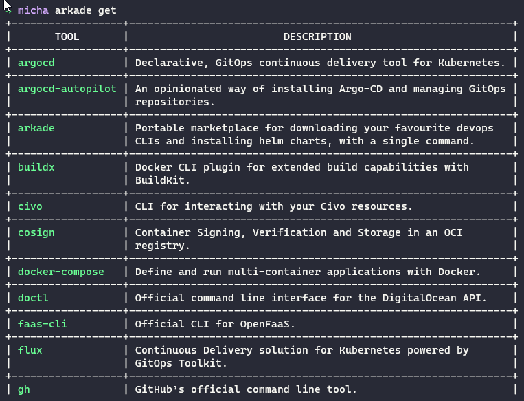
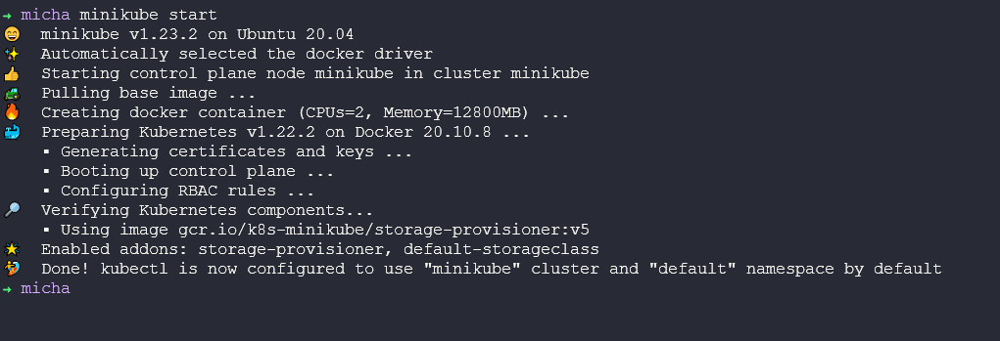
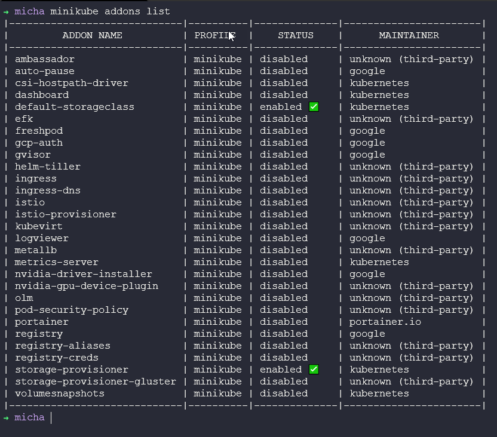

## Deploying your first Kubernetes Cluster

In this post we are going get a Kubernetes cluster up and running on our local machine using minikube, this will give us a baseline Kubernetes cluster for the rest of the Kubernetes section, although we will look at deploying a Kubernetes cluster also in VirtualBox later on. The reason for choosing this method vs spinning a managed Kubernetes cluster up in the public cloud is that this is going to cost money even with the free tier, I shared some blogs though if you would like to spin up that environment in the previous section [Day 50](day50.md).

### What is Minikube?

> “minikube quickly sets up a local Kubernetes cluster on macOS, Linux, and Windows. We proudly focus on helping application developers and new Kubernetes users.”

You might not fit into the above but I have found minikube is a great little tool if you just want to test something out in a Kubernetes fashion, you can easily deploy and app and they have some amazing add ons which I will also cover.

To begin with regardless of your workstation OS, you can run minikube. First, head over to the [project page here](https://minikube.sigs.k8s.io/docs/start/). The first option you have is choosing your installation method. I did not use this method, but you might choose to vs my way (my way is coming up).

mentioned below it states that you need to have a “Container or virtual machine manager, such as: Docker, Hyperkit, Hyper-V, KVM, Parallels, Podman, VirtualBox, or VMware” this is where MiniKube will run and the easy option and unless stated in the repository I am using Docker. You can install Docker on your system using the following [link](https://docs.docker.com/get-docker/).

### My way of installing minikube and other prereqs…

I have been using arkade for some time now to get all those Kubernetes tools and CLIs, you can see the installation steps on this [github repository](https://github.com/alexellis/arkade) for getting started with Arkade. I have also mentioned this in other blog posts where I needed something installing. The simplicity of just hitting arkade get and then seeing if your tool or cli is available is handy. In the Linux section we spoke about package manager and the process for getting our software, you can think about Arkade as that marketplace for all your apps and clis for Kubernetes. A very handy little tool to have on your systems, written in Golang and cross platform.

As part of the long list of available apps within arkade minikube is one of them so with a simple `arkade get minikube` command we are now downloading the binary and we are good to go.

We will also need kubectl as part of our tooling so you can also get this via arkade or I believe that the minikube documentation brings this down as part of the curl commands mentioned above. We will cover more on kubectl later on in the post.

### Getting a Kubernetes cluster up and running

For this particular section I want to cover the options available to us when it comes to getting a Kubernetes cluster up and running on your local machine. We could simply run the following command and it would spin up a cluster for you to use.

minikube is used on the command line, and simply put once you have everything installed you can run `minikube start` to deploy your first Kubernetes cluster. You will see below that the Docker Driver is the default as to where we will be running our nested virtualisation node. I mentioned at the start of the post the other options available, the other options help when you want to expand what this local Kubernetes cluster needs to look like.

A single Minikube cluster is going to consist of a single docker container in this instance which will have the control plane node and worker node in one instance. Where as typically you would separate those nodes out. Something we will cover in the next section where we look at still home lab type Kubernetes environments but a little closer to production architecture.

I have mentioned this a few times now, I really like minikube because of the addons available, the ability to deploy a cluster with a simple command including all the required addons from the start really helps me deploy the same required setup everytime.

Below you can see a list of those addons, I generally use the `csi-hostpath-driver` and the `volumesnapshots` addons but you can see the long list below. Sure these addons can generally be deployed using Helm again something we will cover later on in the Kubernetes section but this makes things much simpler.

I am also defining in our project some additional configuration, apiserver is set to 6433 instead of a random API port, I define the container runtime also to containerd however docker is default and CRI-O is also available. I am also setting a specific Kubernetes version.

Now we are ready to deploy our first Kubernetes cluster using minikube. I mentioned before though that you will also need `kubectl` to interact with your cluster. You can get kubectl installed using arkade with the command `arkade get kubectl`

or you can download cross platform from the following

- [Linux](https://kubernetes.io/docs/tasks/tools/install-kubectl-linux)
- [macOS](https://kubernetes.io/docs/tasks/tools/install-kubectl-macos)
- [Windows](https://kubernetes.io/docs/tasks/tools/install-kubectl-windows)

Once you have kubectl installed we can then interact with our cluster with a simple command like `kubectl get nodes`

### What is kubectl?

We now have our minikube | Kubernetes cluster up and running and I have asked you to install both Minikube where I have explained at least what it does but I have not really explained what kubectl is and what it does.

kubectl is a cli that is used or allows you to interact with Kubernetes clusters, we are using it here for interacting with our minikube cluster but we would also use kubectl for interacting with our enterprise clusters across the public cloud.

We use kubectl to deploy applications, inspect and manage cluster resources. A much better [Overview of kubectl](https://kubernetes.io/docs/reference/kubectl/overview/) can be found here on the Kubernetes official documentation.

kubectl interacts with the API server found on the Control Plane node which we breifly covered in an earlier post.

### kubectl cheat sheet

Along with the official documentation, I have also found myself with this page open all the time when looking for kubectl commands. [Unofficial Kubernetes](https://unofficial-kubernetes.readthedocs.io/en/latest/)

| Listing Resources        |                                            |
| ------------------------ | ------------------------------------------ |
| kubectl get nodes        | List all nodes in cluster                  |
| kubectl get namespaces   | List all namespaces in cluster             |
| kubectl get pods         | List all pods in default namespace cluster |
| kubectl get pods -n name | List all pods in "name" namespace          |

| Creating Resources            |                                             |
| ----------------------------- | ------------------------------------------- |
| kubectl create namespace name | Create a namespace called "name"            |
| kubectl create -f [filename]  | Create a resource from a JSON or YAML file: |

| Editing Resources            |                   |
| ---------------------------- | ----------------- |
| kubectl edit svc/servicename | To edit a service |

| More detail on Resources |                                                         |
| ------------------------ | ------------------------------------------------------- |
| kubectl describe nodes   | display the state of any number of resources in detail, |

| Delete Resources   |                                                  |
| ------------------ | ------------------------------------------------ |
| kubectl delete pod | Remove resources, this can be from stdin or file |

You will find yourself wanting to know the short names for some of the kubectl commands, for example `-n` is the short name for `namespace` which makes it easier to type a command but also if you are scripting anything you can have much tidier code.

| Short name | Full name                  |
| ---------- | -------------------------- |
| csr        | certificatesigningrequests |
| cs         | componentstatuses          |
| cm         | configmaps                 |
| ds         | daemonsets                 |
| deploy     | deployments                |
| ep         | endpoints                  |
| ev         | events                     |
| hpa        | horizontalpodautoscalers   |
| ing        | ingresses                  |
| limits     | limitranges                |
| ns         | namespaces                 |
| no         | nodes                      |
| pvc        | persistentvolumeclaims     |
| pv         | persistentvolumes          |
| po         | pods                       |
| pdb        | poddisruptionbudgets       |
| psp        | podsecuritypolicies        |
| rs         | replicasets                |
| rc         | replicationcontrollers     |
| quota      | resourcequotas             |
| sa         | serviceaccounts            |
| svc        | services                   |

The final thing to add here is that I created another project around minikube to help me quickly spin up demo environments to display data services and protecting those workloads with Kasten K10, [Project Pace](https://github.com/MichaelCade/project_pace) can be found there and would love your feedback or interaction, it also displays or includes some automated ways of deploying your minikube clusters and creating different data services applications.

Next up, we will get in to deploying multiple nodes into virtual machines using VirtualBox but we are going to hit the easy button there like we did in the Linux section where we used vagrant to quickly spin up the machines and deploy our software how we want them.

I added this list to the post yesterday which are walkthrough blogs I have done around different Kubernetes clusters being deployed.

- [Kubernetes playground – How to choose your platform](https://vzilla.co.uk/vzilla-blog/building-the-home-lab-kubernetes-playground-part-1)
- [Kubernetes playground – Setting up your cluster](https://vzilla.co.uk/vzilla-blog/building-the-home-lab-kubernetes-playground-part-2)
- [Getting started with Amazon Elastic Kubernetes Service (Amazon EKS)](https://vzilla.co.uk/vzilla-blog/getting-started-with-amazon-elastic-kubernetes-service-amazon-eks)
- [Getting started with Microsoft Azure Kubernetes Service (AKS)](https://vzilla.co.uk/vzilla-blog/getting-started-with-microsoft-azure-kubernetes-service-aks)
- [Getting Started with Microsoft AKS – Azure PowerShell Edition](https://vzilla.co.uk/vzilla-blog/getting-started-with-microsoft-aks-azure-powershell-edition)
- [Getting started with Google Kubernetes Service (GKE)](https://vzilla.co.uk/vzilla-blog/getting-started-with-google-kubernetes-service-gke)
- [Kubernetes, How to – AWS Bottlerocket + Amazon EKS](https://vzilla.co.uk/vzilla-blog/kubernetes-how-to-aws-bottlerocket-amazon-eks)
- [Getting started with CIVO Cloud](https://vzilla.co.uk/vzilla-blog/getting-started-with-civo-cloud)
- [Minikube - Kubernetes Demo Environment For Everyone](https://vzilla.co.uk/vzilla-blog/project_pace-kasten-k10-demo-environment-for-everyone)

### What we will cover in the series on Kubernetes

We have started covering some of these mentioned below but we are going to get more hands on tomorrow with our second cluster deployment then we can start deploying applications into our clusters.

- Kubernetes Architecture
- Kubectl Commands
- Kubernetes YAML
- Kubernetes Ingress
- Kubernetes Services
- Helm Package Manager
- Persistant Storage
- Stateful Apps

## Resources

If you have FREE resources that you have used then please feel free to add them in here via a PR to the repository and I will be happy to include them.

- [Kubernetes Documentation](https://kubernetes.io/docs/home/)
- [TechWorld with Nana - Kubernetes Tutorial for Beginners [FULL COURSE in 4 Hours]](https://www.youtube.com/watch?v=X48VuDVv0do)
- [TechWorld with Nana - Kubernetes Crash Course for Absolute Beginners](https://www.youtube.com/watch?v=s_o8dwzRlu4)
- [Kunal Kushwaha - Kubernetes Tutorial for Beginners | What is Kubernetes? Architecture Simplified!](https://www.youtube.com/watch?v=KVBON1lA9N8)

See you on [Day 52](day52.md)
