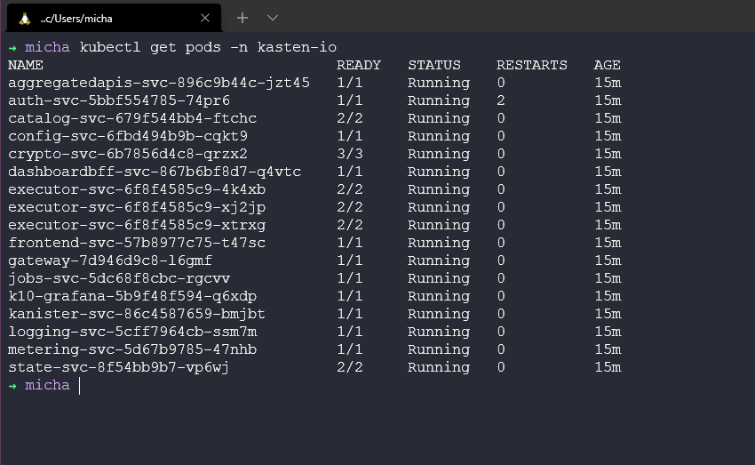
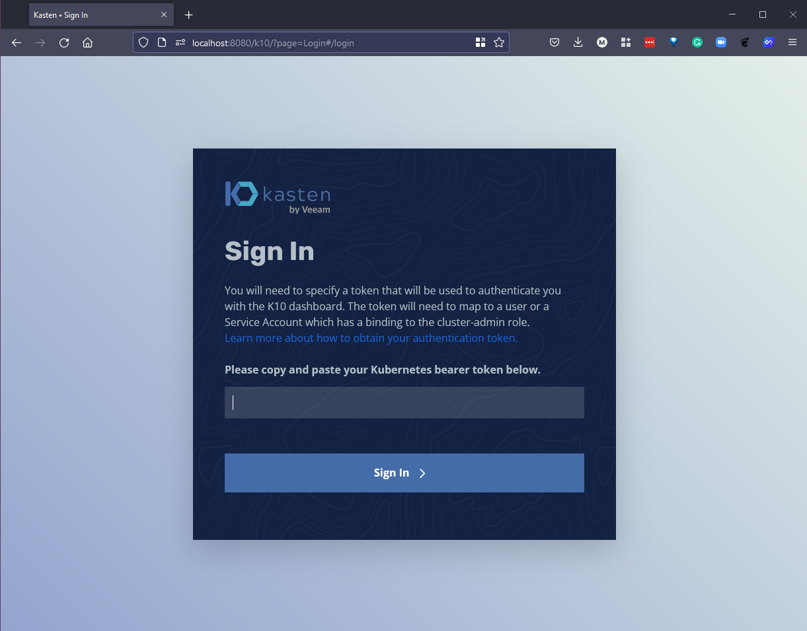
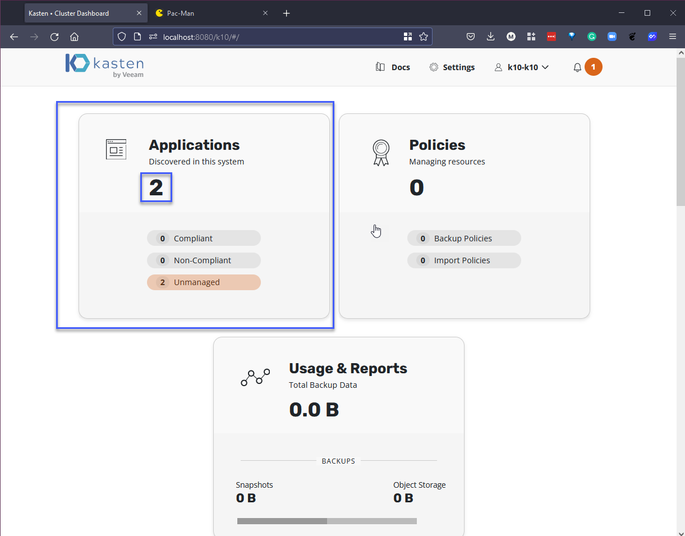
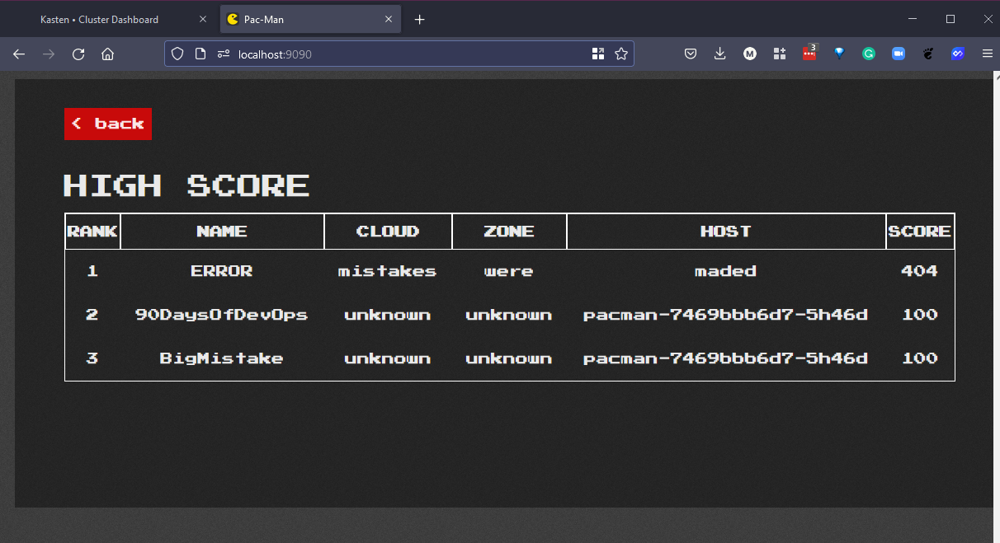

## Hands-On Backup & Recovery

In the last session we touched on [Kopia](https://kopia.io/) an Open-Source backup tool that we used to get some important data off to a local NAS and off to some cloud based object storage. 

In this section, I want to get into the world of Kubernetes backup. It is a platform we covered [The Big Picture: Kubernetes](Days/day49.md) earlier in the challenge. 

We will again be using our minikube cluster but this time we are going to take advantage of some of those addons that are available. 

### Kubernetes cluster setup 

To set up our minikube cluster we will be issuing the `minikube start --addons volumesnapshots,csi-hostpath-driver --apiserver-port=6443 --container-runtime=containerd -p 90daysofdevops --kubernetes-version=1.21.2` you will notice that we are using the `volumesnapshots` and `csi-hostpath-driver` as we will take full use of these for when we are taking our backups. 

At this point I know we have not deployed Kasten K10 yet but we want to issue the following command when your cluster is up, but we want to annotate the volumesnapshotclass so that Kasten K10 can use this. 

```
kubectl annotate volumesnapshotclass csi-hostpath-snapclass \
    k10.kasten.io/is-snapshot-class=true
```

We are also going to change over the default storageclass from the standard default storageclass to the csi-hostpath storageclass using the following. 

```
kubectl patch storageclass csi-hostpath-sc -p '{"metadata": {"annotations":{"storageclass.kubernetes.io/is-default-class":"true"}}}'

kubectl patch storageclass standard -p '{"metadata": {"annotations":{"storageclass.kubernetes.io/is-default-class":"false"}}}'
```


### Deploy Kasten K10 

Add the Kasten Helm repository

`helm repo add kasten https://charts.kasten.io/`

We could use `arkade kasten install k10` here as well but for the purpose of the demo we will run through the following steps. [More Details](https://blog.kasten.io/kasten-k10-goes-to-the-arkade)

Create the namespace and deploy K10, note that this will take around 5 mins 

`helm install k10 kasten/k10 --namespace=kasten-io --set auth.tokenAuth.enabled=true --set injectKanisterSidecar.enabled=true --set-string injectKanisterSidecar.namespaceSelector.matchLabels.k10/injectKanisterSidecar=true --create-namespace`


You can watch the pods come up by running the following command.

`kubectl get pods -n kasten-io -w`



Port forward to access the K10 dashboard, open a new terminal to run the below command

`kubectl --namespace kasten-io port-forward service/gateway 8080:8000`

The Kasten dashboard will be available at: `http://127.0.0.1:8080/k10/#/`



To authenticate with the dashboard we now need the token which we can get with the following commands. 

```
TOKEN_NAME=$(kubectl get secret --namespace kasten-io|grep k10-k10-token | cut -d " " -f 1)
TOKEN=$(kubectl get secret --namespace kasten-io $TOKEN_NAME -o jsonpath="{.data.token}" | base64 --decode)

echo "Token value: "
echo $TOKEN
```


Now we take this token and we input that into our browser, you will then be prompted for an email and company name. 


Then we get access to the Kasten K10 dashboard. 


### Deploy our stateful application 

Use the stateful application that we used in the Kubernetes section. 


You can find the YAML configuration file for this application here[pacman-stateful-demo.yaml](Days/Kubernetes/pacman-stateful-demo.yaml)


We can use `kubectl get all -n pacman` to check on our pods coming up. 


In a new terminal we can then port forward the pacman front end. `kubectl port-forward svc/pacman 9090:80 -n pacman`

Open another tab on your browser to http://localhost:9090/ 


Take the time to clock up some high scores in the backend MongoDB database. 


### Protect our High Scores 

Now we have some mission critical data in our database and we do not want to lose it. We can use Kasten K10 to protect this whole application. 

If we head back into the Kasten K10 dashboard tab you will see that our number of application has now increased from 1 to 2 with the addition of our pacman application to our Kubernetes cluster. 



If you click on the Applications card you will see the automatically discovered applications in our cluster. 


With Kasten K10 we have the ability to leverage storage based snapshots as well export our copies out to object storage options. 

For the purpose of the demo, we will create a manual storage snapshot in our cluster and then we can add some rogue data to our high scores to simulate an accidental mistake being made or is it? 

Firstly we can use the manual snapshot option below. 


For the demo I am going to leave everything as the default 


Back on the dashboard you get a status report on the job as it is running and then when complete it should look as successful as this one. 


### Failure Scenario 

We can now make that fatal change to our mission critical data by simply adding in a prescriptive bad change to our application. 

As you can see below we have two inputs that we probably dont want in our production mission critical database.



### Restore the data

Obviously this is a simple demo and in a way not realistic although have you seen how easy it is to drop databases? 

Now we want to get that high score list looking a little cleaner and how we had it before the mistakes were made. 

Back in the Applications card and on the pacman tab we now have 1 restore point we can use to restore from. 


When you select restore you can see all the associated snapshots and exports to that application. 


Select that restore and a side window will appear, we will keep the default settings and hit restore. 


Confirm that you really want to make this happen. 


You can then go back to the dashboard and see the progress of the restore. You should see something like this. 


But more importantly how is our High-Score list looking in our mission critical application. You will have to start the port forward again to pacman as we previously covered. 


A super simple demo and only really touching the surface of what Kasten K10 can really achieve when it comes to backup. I will be creating some more in depth video content on some of these areas in the future. We will also be using Kasten K10 to highlight some of the other prominent areas around Data Management when it comes to Disaster Recovery and the mobility of your data. 

Next we will take a look at Application consistency. 

## Resources 

- [Kubernetes Backup and Restore made easy!](https://www.youtube.com/watch?v=01qcYSck1c4&t=217s)
- [Kubernetes Backups, Upgrades, Migrations - with Velero](https://www.youtube.com/watch?v=zybLTQER0yY)
- [7 Database Paradigms](https://www.youtube.com/watch?v=W2Z7fbCLSTw&t=520s)
- [Disaster Recovery vs. Backup: What's the difference?](https://www.youtube.com/watch?v=07EHsPuKXc0)
- [Veeam Portability & Cloud Mobility](https://www.youtube.com/watch?v=hDBlTdzE6Us&t=3s)

See you on [Day 88](day88.md)