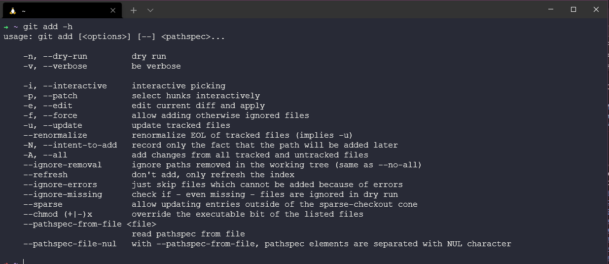

## Git 入門

本篇的作者在這裡玩了個諧音梗，把英文的 Getting to know Git 改寫成 Gitting to know Git。

在前兩篇文章中我們學習了有關版本控制，[第35天](day35.md)講到 Git 做為一個版本控制系統具有哪些基本的工作流程。[第36天](day36.md)講到如何安裝、更新和設定，更稍稍地深入探討主從式和分佈式版本控制系統 Git 之間的理論。

現在，我們將迅速帶過在 Git 常見的指令和使用案例。

### 何處取得Git文件?

有時候你會忘記或是不曉得要用什麼 Git 指令來達到你要的需求。這時候你會需要幫助。

不用說通常大家都會優先用 Google 或任何的搜尋引擎尋找你要的答案。

第二種方法是你也能到 Git 官方網站取得文件說明。 [git-scm.com/docs](http://git-scm.com/docs) 連結裡不僅可以找到所有命令的參考資訊，還能找到不同的資源(如下圖)。

從終端機上也有跟 Git 官方網站相同的說明。如果我們要用指令`git add`，但是不確定使用方式時就能夠輸入`git add --help`來取得說明。

我們也可以輸入指令`git add -h`來取得簡潔的說明。

### 圍繞在 Git 的神話

"Git 沒有存取控制功能" - 但你可以授權一名領導者維護原始碼。

"Git 太肥" - 如果你有大型的專案，Git 有能力提供淺層儲存庫，基本上這意味著它能夠減少歷史的紀錄。

### 真正的缺點

不適合用在二進位檔案。Git 適合用在原始碼，如果是執行檔或影片就不建議。

Git 對使用的人並不友善，事實上我們必須花費時間討論命令和功能怎麼使用。

整理來說，Git 難學好用。

### Git 生態系統

我想要從宏觀的角度來介紹環繞在 Git 間的生態系統，但是我不會深入探討其中的一些領域。

幾乎所有的開發工具都支援 Git。

- 開發工具 - 我們曾經提到微軟的 visual studio code 有支援，其他的文字編輯器像是 sublime text 也有提供外掛整合 Git。
- 團隊工具 - 用來做持續整合/持續佈署的 Jekins， Slack 的訊息框架和專案管理/問題追蹤系統 Jira。
- 雲端供應商 - 所有的雲端供應商都有支援 Git，Microsoft Azure、Amazon AWS、Google Cloud Platform。
- 基於Git的服務 - GitHub、GitLab 和 BitBucket 之後會有更詳盡的探討。我聽過這些服務是程式碼的社交網路！

### Git Cheatsheet

我們沒有列出大部分可用的指令，看過一些線上的 Git cheatsheets之後，我紀錄一些指令和其目的。你並不需要記下所有的指令，你只要頻繁的使用自然而然就會記得。

我從 [atlassian](https://www.atlassian.com/git/tutorials/atlassian-git-cheatsheet) 連結抄寫上面的指令和說明，就像是每天親身參與的日常任務，這也是了解 Git 指令的一種好方法。

### Git 基本操作

| 指令          | 範例                        | 描述                                                                              |
| --------------- | ----------------------------- | ----------------------------------------------------------------------------------- |
| git init      | `git init <directory>`      | 在指定的資料夾上建立一個空的 Git 儲存庫。                                         |
| git clone     | `git clone <repo>`          | 將遠端的儲存庫複製到自己的電腦上。                                                |
| git config    | `git config user.name`      | 為目前的儲存庫定義每次提交時用的作者名，可增加配置選項`system`、`global`、`local` |
| git add       | `git add <directory>`       | 將檔案或目錄加入索引。也可以輸入 <.> 索引所有的檔案。                             |
| git commit -m | `git commit -m "<message>"` | 將索引的檔案提交出去，-m 加入註解。                                               |
| git status    | `git status`                | 列出那些檔案已索引、未索引、未追蹤。                                              |
| git log       | `git log`                   | 用預設格式列出所有提交的歷史紀錄，這個指令有其他選項可用。                        |
| git diff      | `git diff`                  | 列出你的工作目錄和索引之間有何差異。                                              |

### Git Undoing Changes

| 指令       | 範例                  | 描述                                                                                      |
| ------------ | ----------------------- | ------------------------------------------------------------------------------------------- |
| git revert | `git revert <commit>` | 進行反向處理，回復該次提交的異動，並建立新的提交。                                        |
| git reset  | `git reset <file>`    | 還原暫存區到最近提交的版本，但是不變動工作目錄的檔案。 這將會取消暫存文件而不做任何覆蓋。 |
| git clean  | `git clean -n`        | 列出那些檔案會從你的工作目錄刪除。`-n`改成`-f`就會真正執行刪除。                          |

### Git Rewriting History

| 指令       | 範例                 | 描述                                                                                                          |
| ------------ | ---------------------- | --------------------------------------------------------------------------------------------------------------- |
| git commit | `git commit --amend` | 將變更過的暫存區和最後的提交合併後取代最後一次的提交。 如果暫存區沒有變更就可以修改註解。                     |
| git rebase | `git rebase <base>`  | 重新定義現在的分支，將現在分支嫁接到其他分支，目標可以是一個 ID、分支名稱、一個標籤或一個 HEAD 的相對參考點。 |
| git reflog | `git reflog`         | 顯示本機儲存庫HEAD變動的歷史紀錄。加配置選項 --relative-date 可以顯示日期，加 --all 顯示所有的參照.           |

### Git Branches

| 指令         | 範例                       | 描述                                                          |
| -------------- | ---------------------------- | --------------------------------------------------------------- |
| git branch   | `git branch`               | 列出儲存庫上所有的分支。再加一個變數名字則可以建立新分支。    |
| git checkout | `git checkout -b <branch>` | 創建一個新的分支。 移除參數 -b 則用來切換一支已經存在的分支。 |
| git merge    | `git merge <branch>`       | 合併到現在的分支。                                            |

### Git Remote Repositories

| 指令           | 範例                          | 描述                                                                         |
| ---------------- | ------------------------------- | ------------------------------------------------------------------------------ |
| git remote add | `git remote add <name> <url>` | 為遠端的倉儲庫建立簡稱，方便之後進行推送。                                   |
| git fetch      | `git fetch <remote> <branch>` | 取回指定分支的更新。如果沒有指定則取回所有的更新到索引，工作目錄不會被更動。 |
| git pull       | `git pull <remote>`           | 取回指定分支的更新，並且立即更新工作目錄上的檔案。                           |
| git push       | `git push <remote> <branch>`  | 將你提交的檔案推送到遠端。如果遠端不存在推送的分支，將會建立新的分支。       |

### Git Diff

| 指令              | 範例                | 描述                                   |
| ------------------- | --------------------- | ---------------------------------------- |
| git diff HEAD     | `git diff HEAD`     | 比對最新的提交和工作目錄內的檔案內容。 |
| git diff --cached | `git diff --cached` | 比對最新的提交和索引內的檔案內容。     |

### Git Config

| 指令                                                | 範例                                                   | 描述                                                                                                                  |
| ----------------------------------------------------- | -------------------------------------------------------- | ----------------------------------------------------------------------------------------------------------------------- |
| git config --global user.name<name>                 | `git config --global user.name <name>`                 | 為系統現在登入的帳號定義每次使用 Git 提交時所用的作者名。                                                             |
| git config --global user.email<email>               | `git config --global user.email <email>`               | 為系統現在登入的帳號定義每次使用 Git 提交時所用的信箱。                                                               |
| git config --global alias<alias-name> <git-command> | `git config --global alias <alias-name> <git-command>` | 幫 Git 指令建立簡稱。                                                                                                 |
| git config --system core.editor<editor>             | `git config --system core.editor <editor>`             | 為所有的系統帳戶設定 Git 預設的文字編輯器，當 Git 需要輸入訊息的時候會用到。<editor> 參數應該指向系統有的文字編輯器。 |
| git config --global --edit                          | `git config --global --edit `                          | 用文件編輯器開啟全域的 Git 設定檔。                                                                                   |

### Git Rebase

| 指令                | 範例                   | 描述                                                                                                 |
| --------------------- | ------------------------ | ------------------------------------------------------------------------------------------------------ |
| git rebase -i<base> | `git rebase -i <base>` | 用非互動的方式將現在的分支嫁接到其他分支。另外啟動文字編輯器提供輸入每次提交時如何轉移到新的分支上。 |

### Git Pull

| 指令                      | 範例                         | 描述                                           |
| --------------------------- | ------------------------------ | ------------------------------------------------ |
| git pull --rebase<remote> | `git pull --rebase <remote>` | 抓取放在遠端的分支並且嫁接在現在的工作目錄上。 |

### Git Reset

| 指令                     | 範例                        | 描述                                                                     |
| -------------------------- | ----------------------------- | -------------------------------------------------------------------------- |
| git reset                | `git reset `                | 還原暫存區到最近提交的版本，但是不變動工作目錄的檔案。                   |
| git reset --hard         | `git reset --hard`          | 還原暫存區和工作目錄到最新提交的版本，即使工作目錄有變更也會還原。       |
| git reset<commit>        | `git reset <commit>`        | 還原暫存區到指定的版本，但是不變動工作目錄的檔案。                       |
| git reset --hard<commit> | `git reset --hard <commit>` | 還原暫存區和工作目錄到指定的版本。刪除未提交的更改，以及之後的所有提交。 |

### Git Push

| 指令                     | 範例                        | Description                                                                                               |
| -------------------------- | ----------------------------- | ----------------------------------------------------------------------------------------------------------- |
| git push<remote> --force | `git push <remote> --force` | 強迫推送即使會發生 non-fast-forward。不要用 --force 選項，除非你很清楚自己在做什麼。                      |
| git push<remote> --all   | `git push <remote> --all`   | 將本地的分支推送到指令的遠端伺服器。                                                                      |
| git push<remote> --tags  | `git push <remote> --tags`  | push 或加上 --all 選項，預設不會傳送標籤到遠端伺服器。加上　--tags 選項才會將本地的標籤推送到遠端儲存庫。 |

## Resources

- [What is Version Control?](https://www.youtube.com/watch?v=Yc8sCSeMhi4)
- [Types of Version Control System](https://www.youtube.com/watch?v=kr62e_n6QuQ)
- [Git Tutorial for Beginners](https://www.youtube.com/watch?v=8JJ101D3knE&t=52s)
- [Git for Professionals Tutorial](https://www.youtube.com/watch?v=Uszj_k0DGsg)
- [Git and GitHub for Beginners - Crash Course](https://www.youtube.com/watch?v=RGOj5yH7evk&t=8s)
- [Complete Git and GitHub Tutorial](https://www.youtube.com/watch?v=apGV9Kg7ics)
- [Git cheatsheet](https://www.atlassian.com/git/tutorials/atlassian-git-cheatsheet)

See you on [第 38 天](day38.md)
